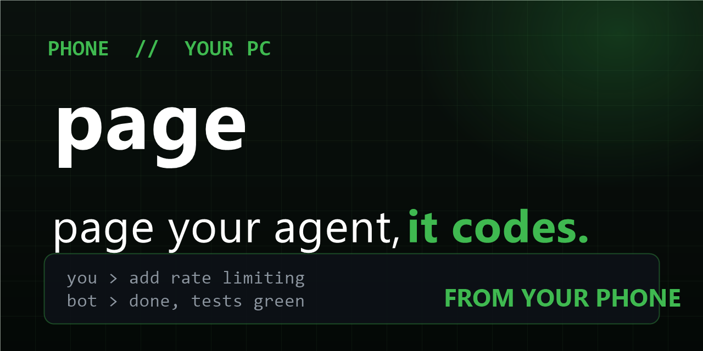

# Page — text your coding agent



[](LICENSE)
[](https://github.com/Figo-star/page/stargazers)
[](https://github.com/Figo-star/page/commits/master)

**Message your coding agent from your phone. It codes on your PC and texts back the result.**

```
you (bus):  add rate limiting to the api
agent:      Done — 3 files, +120/-40, tests green.
            Say the word and I'll push.
```

## How it works

`page` long-polls Telegram for your messages (outbound HTTPS — **no open ports, no Tailscale, no tunnel needed**), runs `opencode run --auto` in your project dir, and replies with the result, chunked to Telegram's limits. Your PC does the work; your phone is just the pager.

## Setup (5 minutes)

1. Message **@BotFather** on Telegram → `/newbot` → copy the token.
2. Message your bot anything, then find your chat id: `https://api.telegram.org/bot<TOKEN>/getUpdates` (look for `chat.id`).
3. Configure:
   ```bash
   cp page.example.json page.json
   # put your chat id(s) in allowFrom, set projectDir
   ```
4. Run it:
   ```bash
   PAGE_BOT_TOKEN=<token> node bin/page.mjs
   ```
5. Text your bot `/ping` → `pong`. Then give it real work.

Keep it running with Task Scheduler / pm2 / a spare terminal.

## Security (read this)

- **`allowFrom` is mandatory** — without it, anyone on Telegram could run commands on your PC. The bridge silently ignores non-allowlisted chats.
- Token lives in env (`PAGE_BOT_TOKEN`), never in the config file — `page.json` is safe to keep, the token isn't in it.
- Point `agent.args` at `--auto` only if you mean it (autonomous opencode). For a supervised mode, drop `--auto`.

## Contents

| File | What |
|---|---|
| [bin/page.mjs](bin/page.mjs) | The bridge: poll → allowlist → run agent → chunked reply. Zero deps. |
| [page.example.json](page.example.json) | Config template (project dir, allowlist, agent command). |
| [agent.md](agent.md) | Phone persona: verdict-first, short replies, diffs summarized. |

## Roadmap

WhatsApp (needs Business API — heavier lift), `/undo` (opencode snapshots), multi-project routing by chat, voice notes via transcription.

## License

MIT — see [LICENSE](LICENSE).
